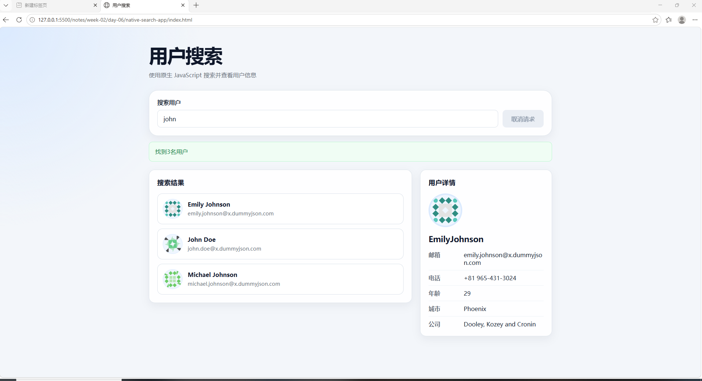

# 原生 JavaScript 用户搜索应用

## 项目介绍

这是一个使用原生 JavaScript 开发的用户搜索应用。用户可以输入关键词搜索用户，并在用户列表中点击查看详细信息。项目不依赖 Vue 等框架，用于练习 ES Modules 模块化、异步网络请求、页面状态管理和 DOM 更新。

## 已实现功能

- 根据关键词搜索用户
- 展示用户列表，并支持查看头像、姓名、城市、电话和邮箱等详细信息
- 展示加载、成功、空数据和错误状态
- 使用防抖减少不必要的请求次数
- 使用 `AbortController` 取消仍在进行中的旧请求
- 使用缓存避免对相同关键词重复发送请求
- 支持手动取消当前搜索请求
- 清空输入框时取消旧请求，并清空列表和详情
- 防止旧请求结果覆盖最新搜索结果

## 使用技术

- HTML5
- CSS3
- 原生 JavaScript
- ES Modules 模块化
- Fetch API
- Promise 与 async/await
- AbortController
- Map
- DOM 与事件委托

## 项目结构

```text
native-search-app/
├── index.html              # 页面结构
├── css/
│   └── style.css           # 页面样式
├── js/
│   ├── api.js              # 请求接口并返回数据
│   ├── state.js            # 保存应用状态和搜索缓存
│   ├── view.js             # 创建和更新页面内容
│   └── main.js             # 连接各模块、绑定事件并组织搜索流程
├── image/
│   └── project-screenshot.png
└── README.md
```

## 模块职责

### api.js

负责拼接接口地址、发送 Fetch 请求、检查 HTTP 状态、解析 JSON 数据，并向 main.js 返回用户数据。它只处理数据请求，不直接修改页面。

### state.js

负责保存当前关键词、当前用户列表、选中的用户、页面状态和当前请求控制器。同时使用 `Map` 保存不同关键词对应的历史搜索结果。

### view.js

负责更新页面，包括状态提示、用户列表、用户详情和取消按钮状态。它不直接发送网络请求。

### main.js

负责绑定输入、点击和取消事件，连接 api.js、state.js 与 view.js，并组织搜索和查看详情的完整流程。

## 搜索执行流程

1. 用户在搜索框中输入关键词。
2. 防抖等待 500 毫秒，等待用户停止输入。
3. main.js 先通过 state.js 检查该关键词是否存在缓存。
4. 如果命中缓存，直接调用 view.js 展示缓存数据。
5. 如果没有命中缓存，main.js 创建 `AbortController`，再通过 api.js 发送搜索请求。
6. api.js 使用 Fetch API 获取并返回用户数组。
7. main.js 确认本次请求仍然是最新请求，然后更新 `appState.users` 和搜索缓存。
8. 最后调用 view.js 展示成功、空数据或错误状态，并渲染用户列表。

## 防抖、取消请求与缓存

### 防抖

用户连续输入时不断取消上一次定时器并重新计时；停止输入 500 毫秒后，才发送搜索请求，从而减少不必要的接口调用。

### 取消请求

开始新搜索前，通过旧控制器的 `abort()` 取消仍在进行中的请求。同时比较本次 `controller` 和 `appState.searchController`，避免旧请求结果更新页面。用户也可以点击取消按钮，手动取消当前请求。

### 搜索缓存

使用 `Map` 保存不同关键词对应的搜索结果。缓存关键词会先删除两端空格并转换成小写，因此 `John`、`john` 和带空格的 ` JOHN ` 可以使用同一份缓存。再次搜索相同关键词时，直接展示缓存数据，不再调用接口。

## 页面状态

- `idle`：等待用户输入
- `loading`：正在请求数据
- `success`：成功取得并展示数据
- `empty`：请求成功，但没有找到用户
- `error`：网络请求或数据处理失败

## 本地运行方法

1. 使用 Visual Studio Code 打开项目目录。
2. 安装并启用 Live Server 扩展。
3. 在 `index.html` 上选择“Open with Live Server”。
4. 在浏览器中输入用户关键词进行搜索。

项目使用 ES Modules，建议通过本地服务器运行，不要直接双击 `index.html` 打开。

## 项目截图



## 学习收获

通过这个项目，我练习了如何使用原生 JavaScript 拆分模块、发送异步请求和更新页面。我理解了防抖只能减少请求次数，`AbortController` 用于取消已经发出的旧请求，而控制器身份检查可以进一步阻止过期结果覆盖最新页面。通过 `appState` 保存当前页面数据，并通过 `Map` 保存多个关键词的历史搜索结果。
